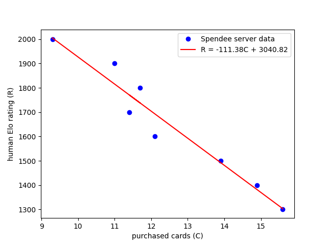
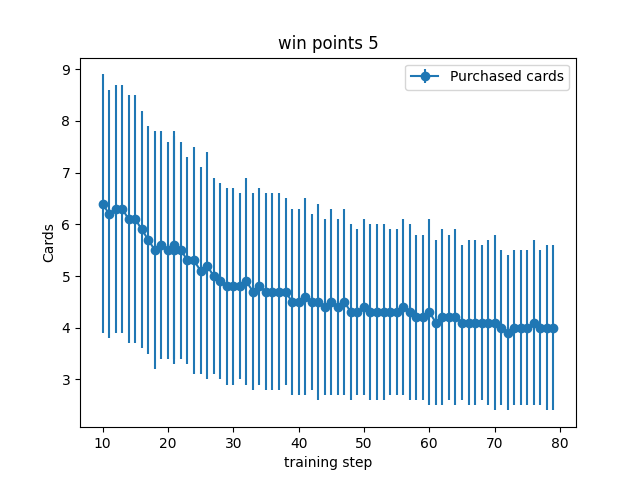

# MCTS with policy netwok strategy for Splendor table game

Wide and shallow or thick and toll? This is the question that is on the mind of every Splendor player around the world. They are thinking about their card stack of course. AI model could give us a decisive answer if trained in an AlphaZero style. This repo is moving towards obtaining a pure self play solution for Splendor.

## Table of Contents
- [Key Features](#key-features)
- [Experimental Results](#experimental-results)
- [Repository Structure](#repository-structure)
- [Requirements](#requirements)
- [Usage](#usage)
- [Implementation Details](#implementation-details)
- [References](#references)

## Key Features

- Splendor game logic and MCTS implemented in Python and C++
- MCTS algorithm with chance node support + embedded neural network policy
- Action selection policy trained with PyTorch from self play
- Games are collected with a fast C++ binary, while neural network training is performed in Python
- Reasonable train speed on a PC due to optimised C++ implementation and parallelisation
- Minimalistic console game interface

## Experimental Results

### Player level estimation

Player's Elo rating $R$ is related to win rate $w$ against opponent with rating $R_{\text{opp}}$ by the equation
$$
w = \frac{1}{1 + 10^{(R_{\text{opp}} - R)/400}}
$$

For Splendor it is hard to find an AI model with confirmed rating. 
An analysis of human games played on an open game platform Spendee is present on their [forum](https://spendee.mattle.online/lobby/forum/topic/mzXQmzjCBmyC56Dgx/splendor-strategy-data-analysis-part-1). Distributions of some game parameters, such as the number of acquired cards, nobles and game length are reported. Using the correlation between average number of acquired cards and human player rating, we can indirectly estimate the rating of the model. We can loosely assume that the average number of cards purchased by the model is proportional to model's Elo rating. 



### Baselines

I report few baselines for 2 player Splendor setup. Strengths of the baselines are approximately transformed to Elo ratings using purchased cards statistics and the equation from the figure above. 

I found out that the most significant increase in game strngth for MCTS based agents comes from limiting chance nodes children size to 1. Chance nodes correspond to new card draw from the deck after a card purchase. The normal branching factor in the MCTS tree is about 10, while chance nodes have branching factor of 30. 

I didn't find it helpful to train state value function. The accuracy of the value fit was low, and additional noise in Node values only worsened performance. In all current experiments only move selection Policy is used to restrict MCTS search tree and make it deeper. 

Increase in the number of MCTS rollouts boosts the performance only slightly, due to large branching factor. In my experience, MCTS gains most from pruning the search tree, increasing it effective depth, and allowing it to reach high value and low variance terminal game states.  

On the RL part, the quality of the training data is essential to make an improvement in performance by adding a policy component to MCTS. 


### Limited game self play

I'm currently unable to get a model with an expert human level through self play. Stable training is only achieved for a restricted game rules. For example, when the number of points to win the game is set to 5, self train procedure succesfully learns starting from a random policy model. The resulting model beats MCTS baselines, but still struggles to confidentely win against an experienced human player. 


Error bars on the figure show 99% confidence interval. For the reference, MCTS is stronger than random player by approximately 750 Elo points (in the win points 5 setup).



Error bars on the figure show one standart deviation. Results for the restricted game setup cannot be correlated to human Elo ratings


## Repository Structure

```
project-root/
│
├── pysplendor/           # Python implementation of Splendor game logic and MCTS
├── src/                  # C++ source files
├── tests/                # Check mutual consistency of the C++ and Python implementations 
├── build.sh              # A script to build C++ splendor binary
├── play.py               # Allows human to play with a trained model in console
├── prepare_data.py       # Converts trajectory dumps into features
├── train.py              # Trains policy model
├── self_play.py          # Runs self play -- train loop
```

## Requirements

- Python 3.10
- PyTorch 2.6.0
- libtorch
- clang
- cmake

### Libtorch installation

Torch Script is used to serialise the model in Python and execute it in C++. Follow the [instructions](https://docs.pytorch.org/tutorials/advanced/cpp_export.html#depending-on-libtorch-and-building-the-application) to download the latest library version [here](https://pytorch.org/). In the `CMakeLists.txt` file the line `set(CMAKE_PREFIX_PATH "/usr/local/libtorch")` defines the path to the unpacked libtorch folder. 

On MacOS you might also need to install libomp
```
brew install libomp
```
and allow access to the dylibs with 
```
sudo xattr -r -d com.apple.quarantine /usr/local/libtorch/lib/libomp.dylib
```

## Usage

### Build the binary

Build C++ binary using `bild.sh` script. This will assemble the binary and copy it to the root folder. `Release` build mode is default. Execute `build.sh Debug` for debug binary version.  

### Run the binary

The binary collects game trajectories using the configuration specified in a JSON input file. Key parameters include:

`agents`: Defines the players (`RandomAgent`, `MCTSAgent`, `PolicyMCTSAgent`):

`model_path`: Path to policy model (for PolicyMCTSAgent)

`iterations`: Number of MCTS rollouts per move

`max_chance_children`: Limits branching at chance nodes (new card draws)

`rotate_agents`: Switches starting player between games (to mitigate first move advantage)

`num_games`: Total games to simulate

`num_workers`: Parallel threads for faster data generation

`win_points`: Shortens games by reducing victory condition (e.g., 5 pts instead of 15)

`dump_trajectories`: Output path for saving games

Example usage:

```
splendor sample_task.json
```

Look at the `sample_task.json` file for a full example.


### Play against a trained model

```
python play.py -m ./workdir/model.pt
```

The console game interface shows:

- Game table and player's states. The game uses single-letter color encodings: r (ruby/red), g (emerald/green), b (diamond/blue), w (pearl/white), k (sapphire/black), and y (gold/yellow joker).

- Available nobles with their requirements (e.g. `[3|r3g3k3]` means 3 points for 3 rubies, 3 emeralds and 3 sapphires)

- Development cards grouped by level (0-2), showing their cost and reward (e.g. `[k0|r1g1b2w1]` is a level 0 sapphire card costing 1 ruby, 1 emerald, 2 diamonds and 1 pearl)

- Available gem tokens on the table

- Each player's current points, collected card bonuses, gem tokens, and reserved cards in hand

```
round: 4 player to move: 1
nobles: [3|r3g3k3] [3|r3g3b3] [3|b4w4]
2: [g5|g3b7] [k4|r7] [k3|r3g5b3w3] [g3|r3b3w5k3]
1: [k2|r3g5] [b2|b3w5] [g3|g6] [k1|g2b2w3]
0: [k0|r1g1b2w1] [b0|r1g1w1k1] [b0|k3] [r0|g1w2k2]
gems: b4w1k3y3
player 0 | points: 0
card gems: 
gems: r3g3w3y2
hand: [w2|r4g1k2] [w2|r5k3]
player 1 | points: 0
card gems: w1
gems: r1g1k1
hand: [w3|w6]
```

### Run self play training loop

### Tests

Tests ensure mutual consistency between Python and C++ game logic and feature computation. Run with `pytest --tb=long tests`

## Implementation Details


## References

[^spendee_forum] 
