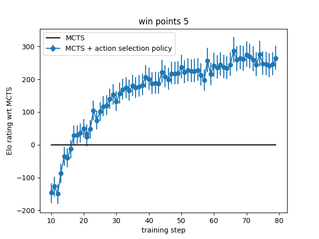
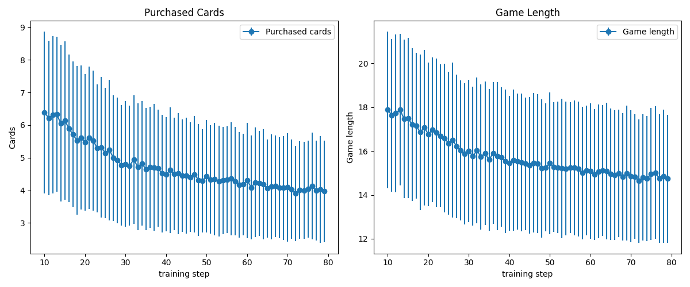

# Monte Carlo Tree Search with Policy Network for Splendor table game

Wide and shallow or tall and thin? Every Splendor player faces this strategic dilemma when building their card tableau. This repository explores whether an AlphaZero-inspired approach can provide the optimal answer through pure self-play reinforcement learning. We implement a neural network-guided Monte Carlo Tree Search (MCTS) system that learns to play limited Splendor variant from scratch, progressively improving its strategy through self-play.

## Table of Contents

- [Key Features](#key-features)
- [Experimental Results](#experimental-results)
- [Repository Structure](#repository-structure)
- [Requirements](#requirements)
- [Usage](#usage)
- [References](#references)

## Key Features

♣️ **Splendor game logic in Python and C++**  

🎲 **Monte Carlo Tree Search with chance node handling**

🤖 **Action selection policy trained with PyTorch from self play**

🔧 **Optimized C++ core for fast game collection even on consumer hardware**

📈 **AlphaZero-style learning from scratch**  

🖥️ **Minimalistic console UI** 

## Experimental Results

### Baselines

We evaluate several baselines in a 2-player Splendor setup. A player's Elo rating $R$ relates to their win rate $w$ against an opponent with rating $R_{\text{opp}}$ via:

$
w = \frac{1}{1 + 10^{(R_{\text{opp}} - R)/400}}
$

Since established AI benchmarks for Splendor are scarce, I compare common strategies directly:

| Agent                          | Win Rate vs Previous | Elo Rating Increase |
|---------------------------------|----------------------|---------------------|
| Random                         | -                    | -                   |
| MCTS (unrestricted chance nodes)| 0.91 ± 0.02          | +400 ± 40           |
| MCTS (500 iterations)          | 0.89 ± 0.03          | +360 ± 55           |
| MCTS (2000 iterations)         | 0.66 ± 0.04          | +115 ± 30           |

The most significant performance improvement comes from limiting chance nodes (which correspond to random card draws after purchases) to just one child node. While normal branches have about 10 possible actions, chance nodes average to 30 potential outcomes. By restricting these nodes, we effectively prune the search tree, allowing the algorithm to maintain deeper search depth

Increase in the number of MCTS rollouts boosts the performance only slightly, due to large branching factor. In my experience, MCTS gains most from pruning the search tree, increasing it effective depth, and allowing it to reach high value and low variance terminal game states.  

Increasing MCTS expansions beyond 500 iterations yields diminishing returns (+115 Elo at 2000 vs 500). The high branching factor of the game favors agressive pruning methods of the MCTS search tree.

Training the state value function proved ineffective in my experiments. The value predictions were inaccurate, and the added noise in node evaluations only degraded performance. In all current implementations, I rely solely on the move selection policy to guide the MCTS search tree, enabling deeper exploration.

### Limited game self play

At present, I am unable to train a model that reaches expert human-level performance through self-play. Stable training is only achievable under restricted game rules. For example, when the number of points required to win is set to 5, the self-training procedure successfully learns from a random initial policy. The resulting model outperforms MCTS baselines but still struggles to consistently defeat experienced human players.



Error bars on the figure indicate a 99% confidence interval. For reference, MCTS is approximately 750 Elo points stronger than a random player (win-points-5 setup, 500 MCTS iterations per move).



Error bars represent one standard deviation. The gradual decrease in the number of acquired cards and game length confirms the model's improving strength.

## Repository Structure

```
project-root/
│
├── pysplendor/           # Python implementation of Splendor game logic and MCTS
├── sample_configs/       # sample configuration files
├── scripts/              # miscellanea
├── src/                  # C++ source files
├── tests/                # Check mutual consistency of the C++ and Python implementations 
├── build.sh              # A script to build C++ splendor binary
├── play.py               # Allows human to play with a trained model in console
├── prepare_features.py   # Converts trajectory dumps into features
├── self_play.py          # Runs self play -- train loop
├── train.py              # Trains policy model
```

## Requirements

- Python 3.10
- PyTorch 2.6.0
- libtorch
- clang
- cmake

### Libtorch installation

Torch Script is used to serialise the model in Python and execute it in C++. Follow the [instructions](https://docs.pytorch.org/tutorials/advanced/cpp_export.html#depending-on-libtorch-and-building-the-application) to download the latest library version [here](https://pytorch.org/). In the `CMakeLists.txt` file the line `set(CMAKE_PREFIX_PATH "/usr/local/libtorch")` defines the path to the unpacked libtorch folder. 

On MacOS you might also need to install libomp
```
brew install libomp
```
and allow access to the dylibs with 
```
sudo xattr -r -d com.apple.quarantine /usr/local/libtorch/lib/libomp.dylib
```

## Usage

### Build the binary

Build C++ binary using `build.sh` script. This will assemble the binary and copy it to the root folder. `Release` build mode is default. Execute `build.sh Debug` for debug binary version.  

### Run the binary

The binary collects game trajectories using the configuration specified in a JSON input file. 

```
splendor sample_configs/random_vs_mcts.json
```

Key parameters include:

`agents`: Defines the players (`RandomAgent`, `MCTSAgent`, `PolicyMCTSAgent`):

`model_path`: Path to policy model (for PolicyMCTSAgent)

`iterations`: Number of MCTS rollouts per move

`max_chance_children`: Limits branching at chance nodes (new card draws)

`rotate_agents`: Switches starting player between games (to mitigate first move advantage)

`num_games`: Total games to simulate

`num_workers`: Parallel threads for faster data generation

`win_points`: Shortens games by reducing victory condition (e.g., 5 pts instead of 15)

`dump_trajectories`: Output path for saving games

### Run train script

Transform collected trajectories into feature files
```
python prepare_features.py --traj_file "trajectories dump file" --data_file "feature path prefix"
```

Then run model training
```
python train.py -c sample_configs/train_config.json
```

### Run self play training loop

Runs previous steps in a loop slowly improving model performance 

```
python train.py -c sample_configs/self_play_config.json
```

### Play against a trained model

```
python play.py -m ./workdir/model.pt
```

The console game interface shows:

- Game table and player's states. The game uses single-letter color encodings: r (ruby/red), g (emerald/green), b (diamond/blue), w (pearl/white), k (sapphire/black), and y (gold/yellow joker).

- Available nobles with their requirements (e.g. `[3|r3g3k3]` means 3 points for 3 rubies, 3 emeralds and 3 sapphires)

- Development cards grouped by level (0-2), showing their cost and reward (e.g. `[k0|r1g1b2w1]` is a level 0 sapphire card costing 1 ruby, 1 emerald, 2 diamonds and 1 pearl)

- Available gem tokens on the table

- Each player's current points, collected card bonuses, gem tokens, and reserved cards in hand

- Action is composed of a prefix letter (`t`=take gems, `r`=reserve card, `p`=purchase from board, `h`=purchase from hand) foloowed by a gem set description or a crad position, e.g. `tr2` means take two rubies or `p1n2` means purchase the level-1 card in position 2 on the board (zero based indexing is used).

```
round: 4 player to move: 1
nobles: [3|r3g3k3] [3|r3g3b3] [3|b4w4]
2: [g5|g3b7] [k4|r7] [k3|r3g5b3w3] [g3|r3b3w5k3]
1: [k2|r3g5] [b2|b3w5] [g3|g6] [k1|g2b2w3]
0: [k0|r1g1b2w1] [b0|r1g1w1k1] [b0|k3] [r0|g1w2k2]
gems: b4w1k3y3
player 0 | points: 0
card gems: 
gems: r3g3w3y2
hand: [w2|r4g1k2] [w2|r5k3]
player 1 | points: 0
card gems: w1
gems: r1g1k1
hand: [w3|w6]
```

### Tests

Tests ensure mutual consistency between Python and C++ game logic and feature computation. Run with 
```
pytest --tb=long tests
```


## References

### Papers

[Forecasting Future Behavior: Agents in Board Game Strategy Dametee et al. 2024](sciencedirect.com/science/article/pii/S187705092401737X)

[Rinascimento: Playing Splendor-like Games with
Event-value Functions Bravi, Lucas 2022](https://qmro.qmul.ac.uk/xmlui/bitstream/handle/123456789/98011/_ToG__Rinascimento__playing_Splendor_like_games_with_Event_value_Functions.pdf)

[Creating an AI opponent with super-human performance for Splendor Simonsson 2023](https://www.diva-portal.org/smash/get/diva2:1779339/FULLTEXT01.pdf)

### Github

[https://github.com/schuber6/Splendor-Bot](https://github.com/schuber6/Splendor-Bot)

[https://github.com/felix-martel/splendor-ai](https://github.com/felix-martel/splendor-ai)
